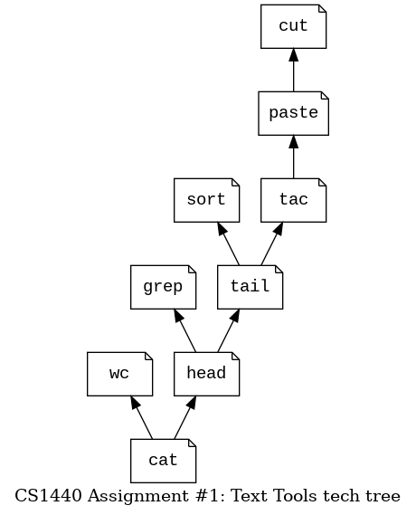

# CS 1440 Assignment 1 Hints

## Students' advice from last semester

*   I kept notes of all of the features of python I had to look up, and simple examples of each of the methods I selected.
*   Compare your program's output with your shell's built-in Unix tools
*   Future students should REALLY focus on the examples. They are literally the backbone of this assignment and are critical for getting all of the different requirements.
*   I didn't write my Plan beforehand, and on the harder modules I probably took twice as long as I would have had I figured it out on paper before or in pseudocode.  It feels like a pain to do, but it would have been way less convoluted.  When I had bugs it was harder to figure out where it was going wrong.
*   Plan, like really plan. And break up the coding into different days so you don't get burned out like I did.
*   Spend a day planning and then implementing each tool.  They aren't hard when you break them down one at a time. 
*   Use a whiteboard to design the elements of the program, and design each element independently from the rest.  
*   I should have been a little more detailed in my plan, then I could have spent less time trying to figure things out as I code and instead spend time just implementing and testing.
*   Even with the plan I created, I got ahead of myself sometimes and got lost in the code/loops.
*   Make sure to take your time thinking through the assignment before you start.  It is pretty easy once you have a detailed plan and an idea how to implement it.
*   Definitely go in the order provided as a hint. Trying to start out on harder tools would have been a nightmare.
*   Learn to reach out to your classmates on the Discord!
*   Don't overthink things.  Most answers are only a few lines long.
*   Work on the basic modules first, do the more difficult ones like "copy/paste" last. If you are careful, you will end up being able to transfer a chunk of code from module to module as you work your way up to the more difficult modules, saving you time and allowing you to focus more on the specific needs of each module.
*   Figuring out how to do cut/paste took a different way of thinking than I was used to. 2 or 3 hours minimum were dedicated to these two.
*   Paste didn't follow the same pattern as cat, so it was much harder to solve.
*   Keep your code simple.  This lets you adapt it to fit different purposes later on.
*   Using command line to run programs was a lot easier than setting up a million PyCharm configurations.
*   Experiment in the REPL to get the right step of codes down.
*   Start early on it, even a half hour a day will get you far.
*   Assuming the last two text tools would be comparable in difficulty to the others led to time constraints and I ended up finishing the last tool late.


## Erik's Hints

### Look for Analogies

*   Each text tool shares the same structure: `Input -> Process -> Output`
*   Once you've written the first tool the rest are a variation on this theme
*   I suggest that you implement the tools in this order, beginning with `cat`: 
*   Remember that these Python tools mimic existing Unix tools that you already have in your shell; when you are really stuck, just run the "real" tool to see what *it* would do


### Did you study the [examples](./examples)?

*   Before you ask for clarification about what your program should do, look for an answer in the examples.


### Cite external sources in `doc/Plan.md`

*   If you found help online, make note of it in your SDP.
*   This is how you will avoid accusations of plagiarism.


### Don't re-invent the wheel

*   All functions built-in to Python are fair game
    *   Here is the [complete list](https://docs.python.org/3/library/functions.html)
*   All methods of the built-in `list` type are fair game in this assignment
    *   Anything that you read in the output of `help(list)`
    *   Lists can be `.sort()`ed and `.reverse()`ed
*   All methods of the built-in `str` type are fair game in this assignment
    *   Anything that you read in the output of `help(str)`
    *   Python's `str` class has some handy methods such as `str.split()` and `str.join()`
*   You don't need to implement your own sorting algorithm in this assignment; you may use the one that is built-in to Python


### Python's list collection is your friend

*   Remember that files can be treated as lists of strings
*   Many of these text tools use a list or two at their heart
*   You job is made easier when you use methods of the `str` class which convert strings to/from lists
*   Python's lists can contain *anything*, even open files.
    *   Instead of reading many files into many lists, try putting the opened file objects into a single list.
*   Don't forget about Python's `in` operator.


### The contents of `sys.argv` are always strings

*   When your program must interpret an argument from `sys.argv` as a number, remember that you must convert it to a number yourself
*   Use `int()` instead of `eval()` to convert strings into numbers
    *   While `eval()` is very convenient it suffers from the major drawback of executing *anything* the user enters as a Python statement; this is a dangerous ability to entrust to your user


### Start by implementing the default behaviors

*   Don't worry about supporting optional command-line arguments until you have a tool's default behavior working right
*   Strings that look like numbers are converted into integers with the `int()` function
    *   `eval()` is evil.
    *   **Do not use `eval()` to convert strings into numbers**


### Segregate responsibilities

*   I've started you off with modules that keep related code together; embrace this organization and don't fight it
*   Decide which actions should happen in the driver program and which actions should occur in the module code
    *   Handle errors as soon as you can reasonably detect them, but do not go out of your way to detect them earlier than necessary; find a balance
    *   Don't open files too early in your program
    *   Don't wait too long to inspect the argument list


### Close files when you are done with them

*   For every call to `open()` you should have a corresponding call to `close()`
*   When you let `open()` throw an error which causes your program to exit ,
    Python will call `close()` for you


### Use `sys.exit()` to terminate your program immediately

*   When your program detects a serious error and cannot proceed, call `sys.exit()` with a non-zero integer parameter to indicate that your program has terminated unsuccessfully
*   Where required, do this in conjunction with calling `usage()` to report the problem to the user

    ```
    usage(error="Unrecognized argument", tool="grep")
    sys.exit(2)
    ```
*   You'll need to `import sys` in each module that you want to use `sys.exit()`


### The `>` symbol is a feature of your shell

*   Your program is only responsible for printing text to the console with `print()`.
*   The `>` redirection operator is part of your shell.
*   You don't have to do anything in Python to enable it (nor can you!)


### Efficiency matters, but only if your code works at all

*   Focus on getting your code to run **correctly** before making it run **fast**
    *   You are graded on functionality, not performance
*   Most tools deal with files one at a time
*   Process input files from beginning to end, one line at a time
        *   Work line-by-line instead of slurping an entire file into a single string variable
        *   For the `tac` tool don't seek to the end and read the file backwards; find another way to print a file in
*   Some tools should process files line-by-line, accumulating nothing into memory.
    *   Some tools, however, must accumulate lines of text into a list to process later
    *   One tool works best when open file objects are stored in a list that you loop over
    *   Identify which approach to take for each tool in your design phase
